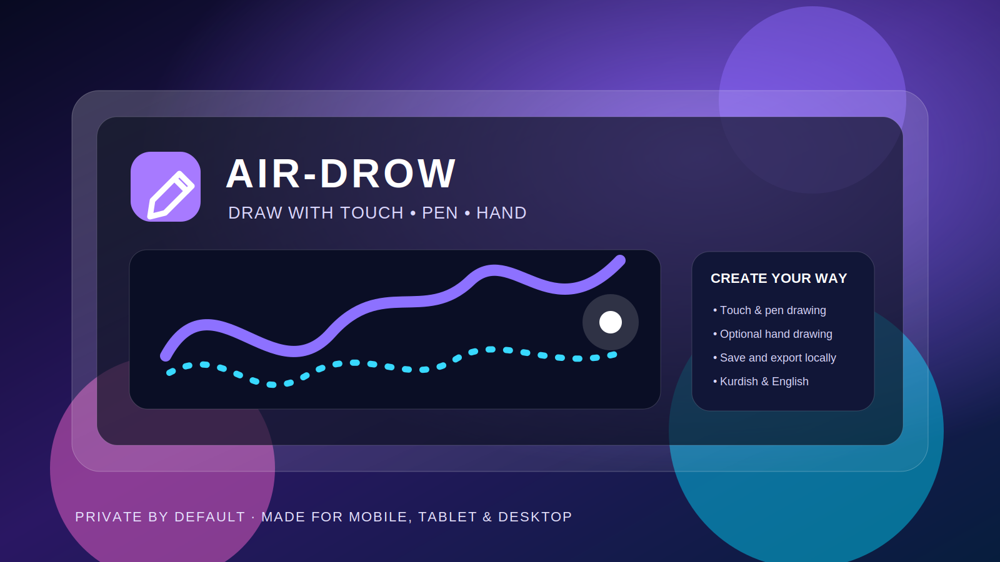
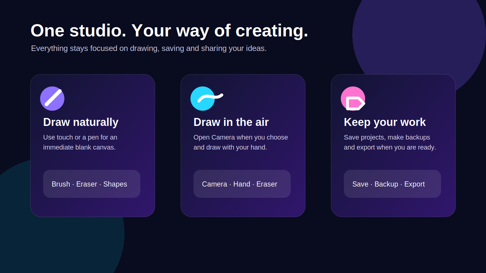

# AIR-DROW

### Draw with touch, pen and hand

**SARHANG IO · 2026 · v7.1.0**

 

 

[Official project on GitHub](https://github.com/sarhang-cs/AIR-DROW)

---

## Welcome to AIR-DROW

**AIR-DROW** is a private drawing studio made for ideas that start anywhere. Draw directly with your finger or pen, then choose the optional camera tool when you want to draw in the air with your hand. Save projects, create a backup, export artwork, and keep your creative space in one place.

AIR-DROW is designed for **mobile, tablet and desktop**. It works in **Kurdî (Sorani)** and **English**, and it keeps your drawing experience simple: create first, adjust settings only when you need them.

## At a glance

| Create | Keep | Share |
| --- | --- | --- |
| Draw with touch, pen, brush, eraser and smart shapes | Save projects locally, recover a recent draft and download a backup | Export artwork and use your device’s sharing options |
| Use optional hand drawing after you open Camera | Your preferences stay on the current device | Create posters, story cards, replays and templates |

## Ways to draw

### Touch and pen

Open AIR-DROW and start drawing immediately. Use the brush, choose a color, adjust the size, and undo or redo whenever you need.

### Hand drawing

Select **Hand** or **Camera**, allow camera access when asked, then keep one hand visible. Bring your fingers close together and move to draw. AIR-DROW never opens the camera by itself; you always choose when the camera starts.

### Shape assistance

Turn on shape assistance when you want cleaner lines, circles, rectangles or triangles. You still control every stroke.

## Save, export and share

- **Save projects** to keep work in the current browser.
- **Backup** before moving to another phone, tablet or browser.
- **Export** artwork in the available formats from the Export section.
- **Share** through your device when sharing is supported.
- **Create packs** for posters, logos, story formats and print-ready ideas.

Your current project is saved before an export is created. When a format is not available on a browser, AIR-DROW offers a compatible local alternative instead of losing your work.

## Privacy first

AIR-DROW is designed to keep creative work close to you.

- Drawings, projects and preferences remain on your device by default.
- Camera permission is requested only after you choose to open Camera.
- Camera video is used for the live hand tool and is not saved by AIR-DROW.
- The hand model and runtime are delivered with the app, so the browser does not need to fetch a hand model while you draw.
- App Check and Camera & Hand Check run locally and do not send a report anywhere.
- Optional AI creation is always an explicit action. Only the sketch you choose for that action is sent to the configured AI service.

Read the full [Privacy Guide](./docs/PRIVACY.md).

## App Check and Camera & Hand Check

In **Settings → About App**, AIR-DROW includes two simple helpers:

- **App Check** confirms that the app, local drawing tools and saved data area are ready. It never opens the camera.
- **Camera & Hand Check** helps after you have opened Camera yourself. It shows whether camera and hand drawing are ready to use.

These checks are made for everyday use. They are not required before you start drawing.

## Install AIR-DROW

AIR-DROW can be installed like an app.

| Device | How to install |
| --- | --- |
| Android / Chromium browsers | Open the browser menu and choose **Install app** or **Add to Home screen** |
| iPhone / iPad | Use **Share → Add to Home Screen** in Safari |
| Desktop | Use the install icon in the address bar when your browser offers it |

After your first successful visit, core app files can remain available when your connection is limited. Camera and optional AI tools still depend on the permissions and services you choose.

## Language

Open **Settings → About App** and choose **Kurdî** or **English**. AIR-DROW keeps your language choice on the current device.

## Helpful tips

- Use a well-lit space for hand drawing.
- Keep your hand fully inside the camera frame.
- Use **Balanced** hand settings first, then choose **Stable** when you want steadier movement.
- Save or download a backup before changing phones or clearing browser data.
- For the smoothest experience, close heavy apps and browser tabs before using Camera.

## What is included in this complete package

This release package includes the AIR-DROW source, the verified local hand model, self-hosted hand runtime files, local fonts, icons, documentation and the production build configuration. `node_modules` is intentionally not included because it is recreated exactly from `package-lock.json` during installation.

## Release notes — v7.1.0

- Cleaned final project structure and unified user-facing app copy.
- Removed build IDs and developer-style labels from the app interface.
- Renamed technical checks into friendly **App Check** and **Camera & Hand Check** tools.
- Updated English and Kurdish documentation for real day-to-day use.
- Included complete local hand-tracking data in the project package.
- Kept the app local-first, installable and ready for production deployment.

## Need help?

Use **Settings → About App** to run App Check, then open Camera and use Camera & Hand Check when you want help confirming hand drawing. For step-by-step guidance, read the [User Guide](./docs/USER_GUIDE.md) or [ڕێنمایی بەکارهێنان](./docs/USER_GUIDE_KU.md).

---

Made for ideas in motion · **AIR-DROW** · [Back to top](#top)

