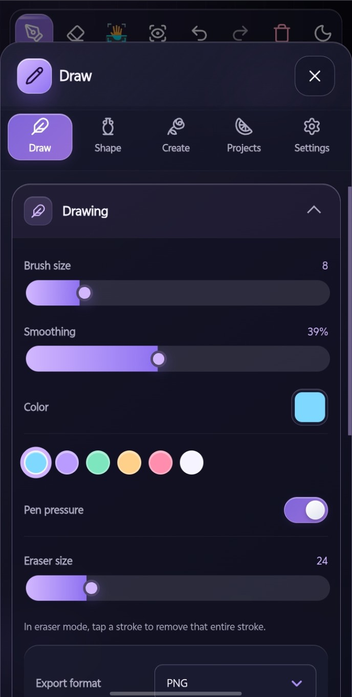
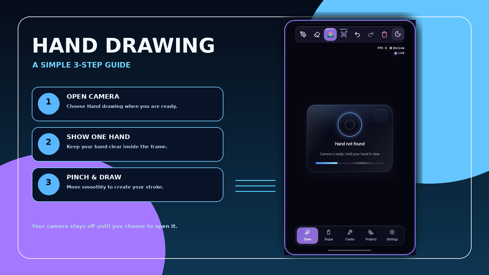

<a id="top"></a>

<div align="center">

# AIR-DROW

### A private drawing studio for touch, pen and hand

**Interaction & Vision Tutorial Edition · v7.6.1 · Created by Sarhang Salah**

[](./docs/PRIVACY.md)
[](#ways-to-draw)
[](#language--themes)
[](#install)

</div>

---

## Screenshots

<table>
  <tr>
    <td width="50%" align="center"><br /><sub>Drawing studio · English · Obsidian dark</sub></td>
    <td width="50%" align="center"><br /><sub>Hand tracking readiness · English · Dark</sub></td>
  </tr>
</table>

## What AIR-DROW does

AIR-DROW is a responsive PWA drawing studio designed for touch, pen and optional hand drawing. It keeps projects, preferences, calibration and exports on the device by default. Hand tracking uses a verified local MediaPipe runtime and model; the camera is never opened until the person explicitly chooses it.

- Draw with touch, pen, brush, eraser and shape assistance.
- Open Camera only when you choose Hand drawing.
- Save local projects, export artwork and make a local backup.
- Switch the complete UI between **Kurdî (Sorani)** and **English**.
- Choose from Violet, Pink, Sapphire, Obsidian, Silver and Gold—each with its own tuned dark and light palette.

## Ways to draw

**Touch and pen.** Open AIR-DROW and draw immediately. Brush size, smoothing, color, pressure, undo and redo are available from the studio.

**Hand drawing.** Open Camera, wait for the local hand engine to become ready, then place one hand in view. The app does not ask you to hold your hand up while the model is still loading. The built-in offline animated guide shows phone placement, a 35–55 cm hand distance, index/thumb pinch and smooth movement. A four-target calibration is saved locally after a real successful check.

**Shape assistance.** Use shape assistance for cleaner lines, circles, rectangles and triangles while keeping direct control of every stroke.

## Privacy

- Drawings, projects, preferences and calibration remain on the current device by default.
- Camera permission is requested only after **Open Camera** is selected.
- Camera frames are used for live hand tracking and are not saved.
- The hand model and runtime are served from AIR-DROW itself—no third-party model CDN is used.
- App checks run locally and do not send a report to an external service.
- Optional AI creation stays disabled until you explicitly configure a controlled server deployment.

Read the full [Privacy Guide](./docs/PRIVACY.md).

## Language & themes

Open **Settings → About App** to switch between Kurdî and English. Runtime cards, calibration guidance, camera messages and recovery notices are re-rendered immediately in the selected language.

Open **Settings → Appearance** to choose dark or light mode and one of the six visual themes. Each palette has contrast-safe text, controls and icons for reliable visibility.

## Developer

**App created by Sarhang Salah**

Instagram: [@sarhang.io](https://www.instagram.com/sarhang.io/) · Scan the QR code in **Settings → About App** to open the profile on a phone.

## Install

| Device | Install method |
| --- | --- |
| Android / Chromium browsers | Open the browser menu and choose **Install app** or **Add to Home screen** |
| iPhone / iPad | Use **Share → Add to Home Screen** in Safari |
| Desktop | Use the install icon in the browser address bar when available |

## Build and deploy

```bash
npm ci --no-audit --no-fund
npm run vercel:build
```

The production gate validates local hand-model integrity, generated MediaPipe runtime files, bilingual dictionaries, dynamic UI coverage, visual-theme contracts, developer profile assets, screenshot documentation and release metadata.

For Android/Termux replacement, use [`termux/TERMUX_INSTALL.txt`](./termux/TERMUX_INSTALL.txt). The installer keeps `.git`, makes a rollback backup, validates the production build, commits and pushes only after a successful gate.

---
<div align="center">Made for ideas in motion · <strong>AIR-DROW</strong> · <a href="#top">Back to top</a></div>


> **v7.6.1:** Android keyboard reliability, high-contrast live-camera controls, and an offline animated hand-position tutorial were added.
